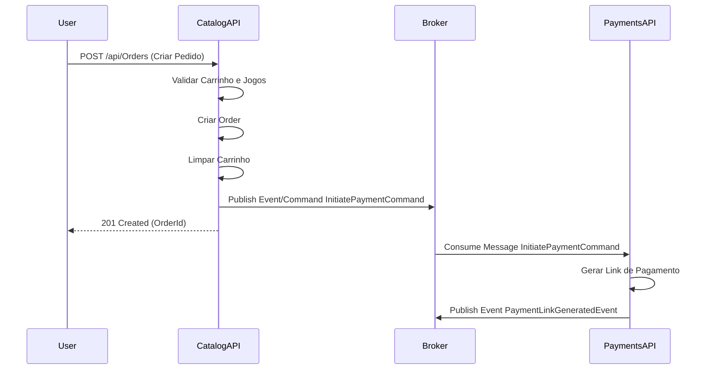
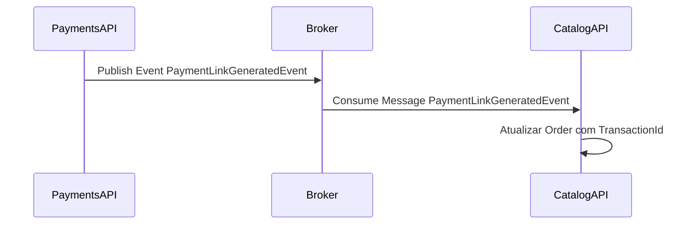
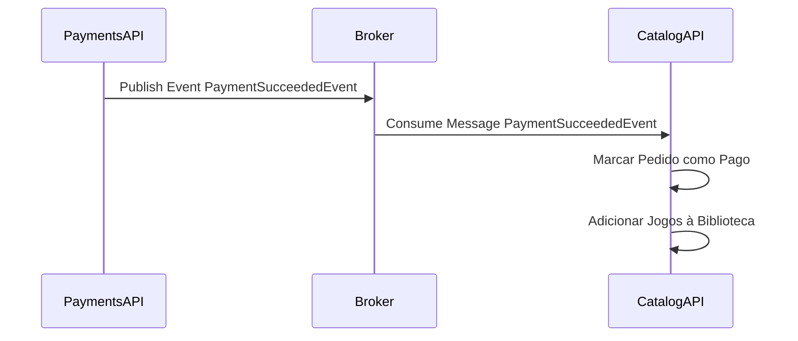
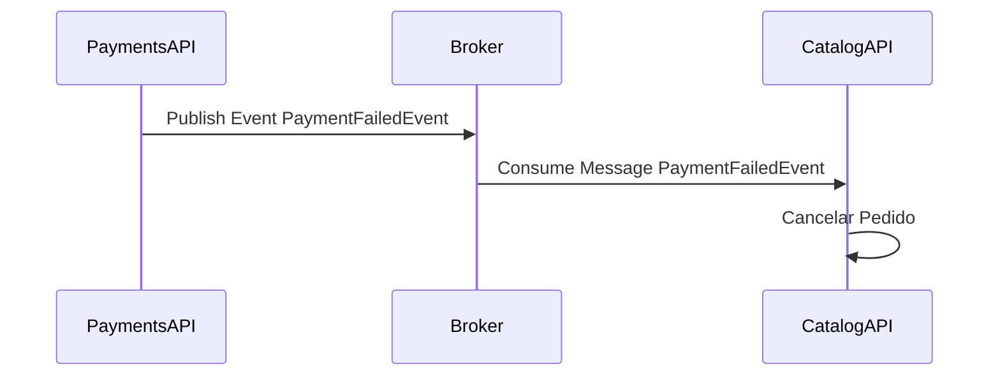
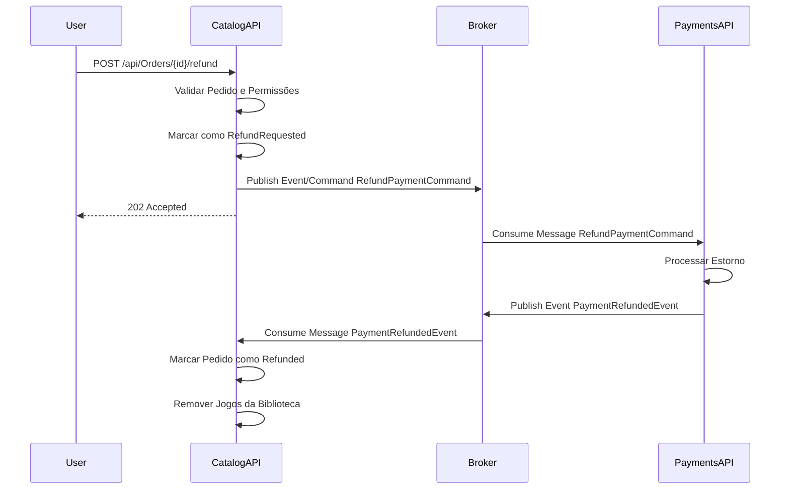
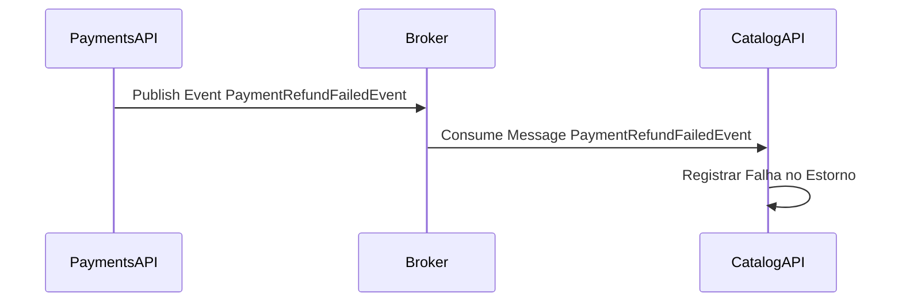

# Tech Challenge - FIAP Cloud Games - 10NETT - Grupo 30 - Fase 2


[](https://github.com/FIAP-10NETT-Grupo-30/cloud-games-fase-4-catalog/tags)

## Microsserviço de Catálogo (CatalogAPI)

Este repositório contém o **Microsserviço de Catálogo** da aplicação FIAP Cloud Games, responsável por gerenciamento de jogos, carrinhos de compra, pedidos, promoções e biblioteca de jogos dos usuários na arquitetura de microsserviços orientada a eventos.

---

## Sumário 📝

- Documentos
  - [Instruções TC Fase 2 (Repositório de Orquestração)](https://github.com/FIAP-10NETT-Grupo-30/cloud-games-fase-4-orchestration-aws/blob/main/docs/TC-NETT-FASE-2.md)
  - [Processo de Colaboração (Repositório de Orquestração)](https://github.com/FIAP-10NETT-Grupo-30/cloud-games-fase-4-orchestration-aws/blob/main/docs/PROCESSO-COLABORACAO.md)
  - [Fluxos (Repositório de Orquestração)](https://github.com/FIAP-10NETT-Grupo-30/cloud-games-fase-4-orchestration-aws/blob/main/docs/Fluxos/README.md)
  - [Kubernetes](./k8s/README.md)
- [Sobre este Microsserviço](#sobre-este-microsservico)
  - [Responsabilidades](#responsabilidades)
  - [Fluxos de Integração](#fluxos-de-integracao)
- [Como rodar o projeto](#como-rodar-o-projeto)
  - [Pré-requisitos](#pre-requisitos)
  - [Executando localmente com Docker Compose](#executando-localmente-com-docker-compose)
  - [Executando localmente com . NET](#executando-localmente-com-net)
  - [Deploy local no Kubernetes (legado/suporte)](#deploy-local-no-kubernetes-legadosuporte)
- [Estrutura de Pastas](#estrutura-de-pastas)
- [Arquitetura do Projeto](#arquitetura-do-projeto)
- [Variáveis de Ambiente](#variaveis-de-ambiente)
- [Endpoints da API](#endpoints-da-api)

---

<a id="sobre-este-microsservico"></a>
## Sobre este Microsserviço 🎯

<a id="responsabilidades"></a>
### Responsabilidades

O **Microsserviço de Catálogo** é responsável por:

- ✅ **Gerenciamento de Jogos**:  CRUD completo de jogos (listagem, detalhes, criação, atualização, exclusão)
- ✅ **Carrinhos de Compra**: Gerenciamento de carrinho por usuário (adicionar, remover, limpar itens)
- ✅ **Pedidos**: Criação e gestão de pedidos a partir do carrinho
- ✅ **Promoções**: Gerenciamento de promoções e descontos em jogos
- ✅ **Biblioteca de Jogos**:  Gerenciamento da biblioteca pessoal de jogos de cada usuário
- ✅ **Integração com Pagamentos**: Envio de comandos e consumo de eventos do serviço de Pagamentos
- ✅ **Seed de Dados**: Popula catálogo inicial com jogos de exemplo

<a id="fluxos-de-integracao"></a>
### Fluxos de Integração

#### 1️⃣ Fluxo de Criação de Pedido



**Comando Enviado:**
- **Queue**: `payments.commands`
- **Command**: `InitiatePaymentCommand`
- **Dados**: `OrderId`, `Amount`, `UserId`, `UserEmail`

#### 2️⃣ Fluxo de Link de Pagamento Gerado



**Evento Consumido:**
- **Queue**: `catalog.events`
- **Event**: `PaymentLinkGeneratedEvent`
- **Dados**: `OrderId`, `UserEmail`, `PaymentTransactionId`, `PaymentLinkUrl`
- **Ação**: Atualiza pedido com ID da transação de pagamento

#### 3️⃣ Fluxo de Pagamento Aprovado



**Evento Consumido:**
- **Queue**: `catalog.events`
- **Event**: `PaymentSucceededEvent`
- **Dados**: `OrderId`, `UserEmail`, `PaymentTransactionId`, `ProcessedAt`
- **Ação**: Marca pedido como pago e adiciona todos os jogos do pedido à biblioteca do usuário

#### 4️⃣ Fluxo de Pagamento Falhou



**Evento Consumido:**
- **Queue**: `catalog.events`
- **Event**: `PaymentFailedEvent`
- **Dados**: `OrderId`, `UserEmail`, `FailedReason`
- **Ação**: Cancela o pedido registrando o motivo da falha

#### 5️⃣ Fluxo de Estorno de Pedido



**Comando Enviado:**
- **Queue**: `payments.commands`
- **Command**: `RefundPaymentCommand`
- **Dados**: `OrderId`, `UserId`, `Reason`

**Evento Consumido:**
- **Queue**: `catalog.events`
- **Event**: `PaymentRefundedEvent`
- **Dados**: `OrderId`, `UserEmail`, `RefundedAt`
- **Ação**: Marca pedido como reembolsado e remove todos os jogos da biblioteca do usuário

#### 6️⃣ Fluxo de Estorno Falhou



**Evento Consumido:**
- **Queue**: `catalog.events`
- **Event**: `PaymentRefundFailedEvent`
- **Dados**: `OrderId`, `UserEmail`, `FailedReason`
- **Ação**: Mantém status do pedido e registra falha no processo de estorno

---

### Resumo dos Eventos Consumidos

| Evento | Ação no Catalog | Consumer |
|--------|----------------|----------|
| `PaymentLinkGeneratedEvent` | Atualiza pedido com ID da transação | `PaymentLinkGeneratedConsumer` |
| `PaymentSucceededEvent` | Marca como pago + adiciona jogos à biblioteca | `PaymentSucceededConsumer` |
| `PaymentFailedEvent` | Cancela o pedido | `PaymentFailedConsumer` |
| `PaymentRefundedEvent` | Marca como reembolsado + remove jogos da biblioteca | `PaymentRefundedConsumer` |
| `PaymentRefundFailedEvent` | Registra falha no estorno | `PaymentRefundFailedConsumer` |

---

<a id="como-rodar-o-projeto"></a>
## Como rodar o projeto ▶️

<a id="pre-requisitos"></a>
### Pré-requisitos ⚙️

- [Git](https://git-scm.com/downloads) instalado na sua máquina
- [Docker Desktop](https://www.docker.com/get-started) instalado e em execução
- [. NET 8 SDK](https://dotnet.microsoft.com/en-us/download/dotnet/8.0) ou superior (para execução local sem Docker)
- [DBeaver](https://dbeaver.io/download/) ou outro cliente de banco de dados compatível com SQL Server

<a id="executando-localmente-com-docker-compose"></a>
### Executando localmente com Docker Compose ⚡

Para desenvolvimento local, a execução da aplicação completa pode ser feita via [Repositório de Orquestração](https://github.com/FIAP-10NETT-Grupo-30/cloud-games-fase-4-orchestration-aws), que contém os docker-compose files e scripts necessários.

No ambiente AWS, o padrão atual do projeto utiliza ECS/Fargate com infraestrutura provisionada por Terraform.

Consulte o [guia de execução com Docker Compose](https://github.com/FIAP-10NETT-Grupo-30/cloud-games-fase-4-orchestration-aws/blob/main/docs/Compose/README.md) no repositório de orquestração. 

<a id="executando-localmente-com-net"></a>
### Executando localmente com . NET 🔧

Para desenvolvimento local sem Docker: 

1. Clone o repositório: 
   ```bash
   git clone https://github.com/FIAP-10NETT-Grupo-30/cloud-games-fase-4-catalog.git
   cd cloud-games-fase-4-catalog
   ```

2. Restaurar as ferramentas do . NET:
   ```bash
   dotnet tool restore
   ```

3. Configurar o User Secrets:
   ```bash
   cd src/Fiap.CloudGames.API
   dotnet user-secrets init
   
   # Configurar as secrets necessárias
   dotnet user-secrets set "ConnectionStrings:DefaultConnection" "Server=localhost,1433;Database=CloudGamesCatalog;User Id=sa;Password=SuaSenha;TrustServerCertificate=True;"
   dotnet user-secrets set "RabbitMq:HostName" "localhost"
   dotnet user-secrets set "RabbitMq:UserName" "guest"
   dotnet user-secrets set "RabbitMq:Password" "guest"
   dotnet user-secrets set "Jwt:Secret" "sua-chave-secreta-jwt-com-pelo-menos-32-caracteres"
   dotnet user-secrets set "Jwt:Issuer" "cloud-games"
   dotnet user-secrets set "Jwt:Audience" "cloud-games-audience"
   ```

4. Garantir que a infraestrutura esteja rodando:
   ```bash
   cd ../../cloud-games-fase-4-orchestration-aws
   docker-compose -f docker-compose.infra.yaml up -d
   ```

5. Aplicar as migrações do banco de dados: 
   ```bash
   cd ../cloud-games-fase-4-catalog
   dotnet ef database update --project src/Fiap.CloudGames.Infrastructure --startup-project src/Fiap.CloudGames.API --context AppDbContext
   ```

6. Executar a aplicação: 
   ```bash
   dotnet run --project src/Fiap.CloudGames.API
   ```

7. Acessar o Swagger: 
   ```
   http://localhost:5214/swagger
   ```

<a id="deploy-local-no-kubernetes-legadosuporte"></a>
### Deploy local no Kubernetes (legado/suporte) ☸️

Consulte a [documentação de Kubernetes](./k8s/README.md) para instruções detalhadas de execução local/legado.

Resumo dos comandos: 

```bash
# Build da imagem Docker
docker build -t cloud-games-catalog-svc:latest .

# Aplicar os manifestos
kubectl apply -f k8s/fcg-apps-namespace.yaml
kubectl apply -f k8s/externalnames-service.yaml
kubectl apply -f k8s/catalog-secret.yaml
kubectl apply -f k8s/catalog-configmap.yaml
kubectl apply -f k8s/catalog-service.yaml
kubectl apply -f k8s/catalog-deployment.yaml

# Verificar o status
kubectl get pods -n fcg-apps
kubectl get services -n fcg-apps
```

**Acessar o Swagger (Kubernetes):**
```
http://localhost:30081/swagger/index.html
```

---

<a id="estrutura-de-pastas"></a>
## Estrutura de Pastas 📁

```
├── . config/
│   └── dotnet-tools.json              # Configurações de ferramentas do .NET CLI (EF Core)
│
├── k8s/                                # Manifests do Kubernetes
│   ├── templates/                      # Templates de exemplo para secrets
│   ├── fcg-apps-namespace.yaml         # Namespace do Kubernetes
│   ├── externalnames-service.yaml      # ExternalNames para SQL Server, RabbitMQ e Loki
│   ├── catalog-secret.yaml             # Secrets (não comitado - use o template)
│   ├── catalog-configmap.yaml          # ConfigMaps com configurações não sensíveis
│   ├── catalog-service.yaml            # Service do Kubernetes (NodePort)
│   ├── catalog-deployment.yaml         # Deployment do Kubernetes
│   └── README.md                       # Documentação detalhada do Kubernetes
│
├── src/
│   ├── Fiap.CloudGames.API/           # Camada de API
│   │   ├── Controllers/                # Controllers REST
│   │   │   ├── GamesController. cs      # Endpoints de jogos
│   │   │   ├── CartsController.cs      # Endpoints de carrinho
│   │   │   ├── OrdersController.cs     # Endpoints de pedidos
│   │   │   ├── PromotionsController.cs # Endpoints de promoções
│   │   │   └── LibraryController.cs    # Endpoints de biblioteca
│   │   └── Program.cs                  # Ponto de entrada da aplicação
│   │
│   ├── Fiap.CloudGames.Application/   # Serviços de aplicação e casos de uso
│   │   ├── Games/                      # Contexto de Jogos
│   │   │   ├── Services/               # Serviços de negócio
│   │   │   ├── Dtos/                   # DTOs
│   │   │   └── Validators/             # Validadores FluentValidation
│   │   ├── Carts/                      # Contexto de Carrinhos
│   │   │   ├── Services/
│   │   │   └── Dtos/
│   │   ├── Orders/                     # Contexto de Pedidos
│   │   │   ├── Services/
│   │   │   └── Dtos/
│   │   ├── Promotions/                 # Contexto de Promoções
│   │   │   ├── Services/
│   │   │   └── Dtos/
│   │   ├── UserGamesLibrary/           # Contexto de Biblioteca
│   │   │   ├── Services/
│   │   │   └── Dtos/
│   │   └── Payments/                   # Integração com Pagamentos
│   │       ├── Consumers/              # Consumidores de eventos de pagamento
│   │       ├── Commands/               # Comandos enviados para Payments
│   │       └── Events/                 # Definições de eventos
│   │
│   ├── Fiap.CloudGames.Domain/        # Entidades, Value Objects, Enums e Interfaces
│   │   ├── Games/
│   │   │   ├── Entities/               # Entidade Game
│   │   │   └── Repositories/           # IGameRepository
│   │   ├── Carts/
│   │   │   ├── Entities/               # Cart, CartItem
│   │   │   └── Repositories/           # ICartRepository
│   │   ├── Orders/
│   │   │   ├── Entities/               # Order, OrderItem
│   │   │   ├── Enums/                  # OrderStatus
│   │   │   └── Repositories/           # IOrderRepository
│   │   ├── Promotions/
│   │   │   ├── Entities/               # Promotion, PromotionItem
│   │   │   ├── Enums/                  # PromotionStatus
│   │   │   ├── ValueObjects/           # Discount, PromotionPeriod
│   │   │   └── Repositories/           # IPromotionRepository
│   │   └── UserGamesLibrary/
│   │       ├── Entities/               # UserGameLibrary (M: N User-Game)
│   │       ├── ValueObjects/           # LibraryFilter
│   │       └── Repositories/           # IUserGameLibraryRepository
│   │
│   └── Fiap.CloudGames.Infrastructure/ # Implementações de persistência e integrações
│       ├── Persistence/                # EF Core, Migrations, Repositories
│       │   ├── EntityConfigurations/   # Configurações do EF Core
│       │   ├── Migrations/             # Migrações do banco de dados
│       │   └── AppDbContext.cs         # DbContext
│       ├── Games/
│       │   ├── Repositories/           # GameRepository
│       │   └── Seeders/                # GameSeeder
│       ├── Carts/
│       │   └── Repositories/           # CartRepository
│       ├── Orders/
│       │   └── Repositories/           # OrderRepository
│       ├── Promotions/
│       │   └── Repositories/           # PromotionRepository
│       ├── UserGamesLibrary/
│       │   └── Repositories/           # UserGameLibraryRepository
│       └── DependencyInjection.cs      # Configuração de dependências
│
├── tests/
│   └── Fiap.CloudGames.Tests/         # Testes Unitários
│
├── .dockerignore
├── . editorconfig
├── .gitattributes
├── .gitignore
├── Dockerfile
├── cloud-games-fase-4-catalog.sln
├── global.json
└── README.md
```

---

<a id="arquitetura-do-projeto"></a>
## Arquitetura do Projeto 🏛️

Este microsserviço segue uma **arquitetura em camadas** (Clean Architecture / Onion Architecture), separando as responsabilidades e facilitando a manutenção e testes.

### Principais Camadas

- **API (Fiap.CloudGames.API)**: Controllers REST, configuração de pipeline HTTP, Swagger e autenticação JWT
- **Application (Fiap.CloudGames.Application)**: Serviços de aplicação, casos de uso, DTOs, consumers e comandos
- **Domain (Fiap.CloudGames.Domain)**: Entidades, value objects, enums e interfaces (contratos)
- **Infrastructure (Fiap.CloudGames.Infrastructure)**: Implementações concretas de persistência (EF Core) e mensageria (implementação atual: RabbitMQ/MassTransit; padrão arquitetural AWS: SQS)

### Tecnologias Utilizadas

- **Framework**: .NET 8
- **Infraestrutura alvo**: AWS (ECS/Fargate, SQS, Lambda, CloudWatch, ECR, Terraform)
- **Banco de Dados**: SQL Server com Entity Framework Core
- **Mensageria**: implementação atual deste serviço com RabbitMQ + MassTransit; padrão arquitetural atual em AWS com Amazon SQS
- **Autenticação**: JWT (JSON Web Tokens)
- **Logging**: Serilog com sink para Grafana Loki
- **Documentação**: Swagger/OpenAPI
- **Containerização**: Docker (multi-stage build)
- **Orquestração**: Kubernetes (suporte local/legado) e ECS/Fargate (padrão AWS)

### Diagrama de Dependências

```mermaid
graph TD
    A[Fiap.CloudGames.API] --> B[Fiap.CloudGames.Application]
    A --> D[Fiap.CloudGames.Infrastructure]
    
    B --> C[Fiap.CloudGames.Domain]
    
    D --> C
    D --> E[SQL Server]
    D --> F[Message Broker (SQS - padrao AWS)]
    D --> G[Loki]
    
    B --> H[Payments Commands Queue]
    F --> I[Payments Events Queue]
    I --> B
```

### Bibliotecas Principais

- `Microsoft.EntityFrameworkCore.SqlServer` - Provedor SQL Server para EF Core
- `Microsoft.AspNetCore.Authentication.JwtBearer` - Autenticação JWT
- `MassTransit.RabbitMQ` - Mensageria da implementação atual deste microsserviço
- `Swashbuckle.AspNetCore` - Geração de documentação Swagger
- `Serilog.AspNetCore` - Logging estruturado
- `Serilog.Sinks.Grafana.Loki` - Sink do Serilog para Loki
- `FluentValidation` - Validação fluente
- `FluentValidation.AspNetCore` - Integração do FluentValidation com ASP.NET Core

---

<a id="variaveis-de-ambiente"></a>
## Variáveis de Ambiente 🔐

### Configurações Sensíveis (Secrets)

Estas variáveis devem ser configuradas via **User Secrets** (desenvolvimento local) e, em ambiente AWS, por mecanismo equivalente de gestão de segredos:

| Variável | Descrição | Exemplo |
|----------|-----------|---------|
| `ConnectionStrings__DefaultConnection` | Connection string do SQL Server | `Server=sqlserver-service,1433;Database=CloudGamesCatalog;User Id=sa;Password=***;TrustServerCertificate=True;` |
| `RabbitMq__HostName` | Hostname do RabbitMQ | `rabbitmq-service` |
| `RabbitMq__UserName` | Usuário do RabbitMQ | `guest` |
| `RabbitMq__Password` | Senha do RabbitMQ | `***` |
| `Jwt__Secret` | Chave secreta para validação de tokens JWT (mínimo 32 caracteres) | `sua-chave-super-secreta-com-pelo-menos-32-caracteres` |

### Configurações Não Sensíveis (ConfigMaps)

Estas variáveis podem ser configuradas via **appsettings.json** (desenvolvimento local) ou mecanismo equivalente de configuração em ambiente AWS:

| Variável | Descrição | Valor Padrão |
|----------|-----------|--------------|
| `ASPNETCORE_ENVIRONMENT` | Ambiente de execução | `Development` / `Production` |
| `Queues__Catalog__Commands` | Nome da fila de comandos de catálogo | `catalog. commands` |
| `Queues__Catalog__Events` | Nome da fila de eventos de catálogo | `catalog.events` |
| `Queues__Payments__Commands` | Nome da fila de comandos de pagamentos | `payments.commands` |
| `Queues__Payments__Events` | Nome da fila de eventos de pagamentos | `payments.events` |
| `Loki__Url` | URL do servidor Loki para logging | `http://loki-service:3100` |
| `Jwt__Issuer` | Emissor do token JWT | `cloud-games` |
| `Jwt__Audience` | Audiência do token JWT | `cloud-games-audience` |
| `Jwt__ExpiryMinutes` | Tempo de expiração do token em minutos | `60` |

> ⚠️ **Importante**: Nunca comite arquivos contendo secrets reais no controle de versão.  Use sempre os templates disponíveis em `k8s/templates/`.

---

<a id="endpoints-da-api"></a>
## Endpoints da API 🌐

### Jogos (Games)

| Método | Endpoint | Descrição | Autenticação |
|--------|----------|-----------|--------------|
| `GET` | `/api/Games` | Lista todos os jogos | ❌ Não |
| `GET` | `/api/Games/{id}` | Obtém um jogo por ID | ❌ Não |
| `POST` | `/api/Games` | Cadastra um novo jogo | ✅ Administrator |
| `PUT` | `/api/Games/{id}` | Atualiza um jogo existente | ✅ Administrator |
| `DELETE` | `/api/Games/{id}` | Exclui um jogo | ✅ Administrator |

**Body (Criar Jogo):**
```json
{
  "title": "Hades",
  "description": "Um roguelike de ação premiado",
  "price": 84.99,
  "releaseDate": "2020-09-17",
  "developer": "Supergiant Games",
  "publisher": "Supergiant Games",
  "genre": "Action, RPG, Roguelike",
  "platforms": "PC, PS5, Xbox Series X/S"
}
```

### Carrinho (Carts)

| Método | Endpoint | Descrição | Autenticação |
|--------|----------|-----------|--------------|
| `GET` | `/api/Carts/mine` | Obtém o carrinho do usuário autenticado | ✅ Sim |
| `POST` | `/api/Carts/mine/items` | Adiciona um jogo ao carrinho | ✅ Sim |
| `DELETE` | `/api/Carts/mine/items/{gameId}` | Remove um jogo do carrinho | ✅ Sim |
| `DELETE` | `/api/Carts/mine` | Limpa todos os itens do carrinho | ✅ Sim |
| `GET` | `/api/Carts` | Lista todos os carrinhos (auditoria) | ✅ Administrator |

**Body (Adicionar ao Carrinho):**
```json
{
  "gameId":  "3fa85f64-5717-4562-b3fc-2c963f66afa6"
}
```

**Headers Opcionais:**
- `Idempotency-Key`: Para garantir idempotência na adição de itens

### Pedidos (Orders)

| Método | Endpoint | Descrição | Autenticação |
|--------|----------|-----------|--------------|
| `POST` | `/api/Orders` | Cria um pedido a partir do carrinho | ✅ Sim |
| `GET` | `/api/Orders/mine` | Lista pedidos do usuário autenticado | ✅ Sim |
| `GET` | `/api/Orders` | Lista todos os pedidos (admin) | ✅ Administrator |
| `GET` | `/api/Orders/{id}` | Obtém um pedido por ID (admin ou dono) | ✅ Sim |
| `POST` | `/api/Orders/{id}/refund` | Solicita estorno do pedido | ✅ Sim (dono ou admin) |

**Body (Criar Pedido):**
```json
{
  "cartId": "3fa85f64-5717-4562-b3fc-2c963f66afa6"
}
```

**Body (Solicitar Estorno):**
```json
{
  "reason": "Jogo não funcionou corretamente"
}
```

**Query Params (Listar Pedidos):**
- `status`: Filtrar por status (`PendingPayment`, `Paid`, `Cancelled`, `RefundRequested`, `Refunded`)
- `page`: Número da página (padrão:  1)
- `pageSize`: Itens por página (padrão:  20)
- `startDate`: Data inicial (admin)
- `endDate`: Data final (admin)

### Promoções (Promotions)

| Método | Endpoint | Descrição | Autenticação |
|--------|----------|-----------|--------------|
| `GET` | `/api/Promotions` | Lista todas as promoções | ✅ Administrator |
| `GET` | `/api/Promotions/{id}` | Obtém uma promoção por ID | ✅ Administrator |
| `POST` | `/api/Promotions` | Cria uma nova promoção | ✅ Administrator |
| `PUT` | `/api/Promotions/{id}` | Atualiza uma promoção | ✅ Administrator |
| `DELETE` | `/api/Promotions/{id}` | Exclui uma promoção | ✅ Administrator |

**Body (Criar Promoção):**
```json
{
  "name": "Black Friday 2026",
  "startDate": "2026-11-25",
  "endDate": "2026-11-30",
  "discount": 50.0,
  "elligibleGames": [
    "3fa85f64-5717-4562-b3fc-2c963f66afa6"
  ]
}
```

### Biblioteca (Library)

| Método | Endpoint | Descrição | Autenticação |
|--------|----------|-----------|--------------|
| `GET` | `/api/Library/my-games` | Obtém a biblioteca do usuário autenticado | ✅ Sim |
| `POST` | `/api/Library/buy/{gameId}` | Simula compra direta de jogo | ✅ Sim |
| `DELETE` | `/api/Library/remove/{gameId}` | Remove jogo da biblioteca | ✅ Sim |

**Query Params (Biblioteca):**
- `search`: Busca por título, desenvolvedor ou publicadora
- `genre`: Filtrar por gênero
- `developer`: Filtrar por desenvolvedor
- `publisher`: Filtrar por publicadora
- `startDate`: Data de lançamento inicial
- `endDate`: Data de lançamento final
- `sortBy`: Ordenar por (`title`, `genre`, `developer`, `publisher`, `purchaseDate`)
- `desc`: Ordem decrescente (padrão: `false`)
- `page`: Número da página (padrão: 1)
- `pageSize`: Itens por página (padrão:  20)

### Health Checks

| Método | Endpoint | Descrição |
|--------|----------|-----------|
| `GET` | `/health/live` | Verifica se o serviço está vivo (liveness probe) |
| `GET` | `/health/ready` | Verifica se o serviço está pronto (readiness probe) |

---

## Repositórios Relacionados 🔗

- **[Orquestração](https://github.com/FIAP-10NETT-Grupo-30/cloud-games-fase-4-orchestration-aws)**: Docker Compose/Kubernetes para desenvolvimento local e AWS (ECS/Fargate + Terraform) como padrão de produção
- **[Usuários](https://github.com/FIAP-10NETT-Grupo-30/cloud-games-fase-4-users)**: Microsserviço de autenticação e autorização
- **[Pagamentos](https://github.com/FIAP-10NETT-Grupo-30/cloud-games-fase-4-payments)**: Microsserviço de processamento de pagamentos
- **[Notificações](https://github.com/FIAP-10NETT-Grupo-30/cloud-games-fase-4-notifications)**: Microsserviço de envio de notificações